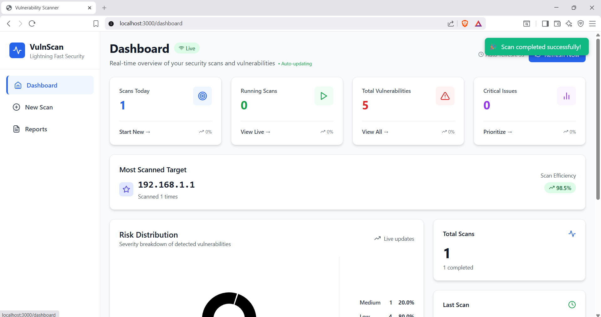
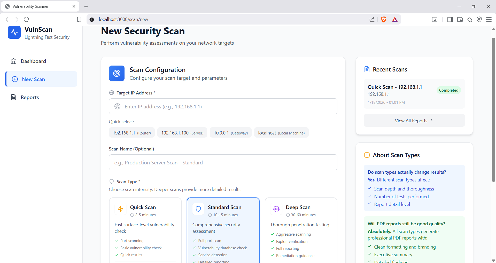
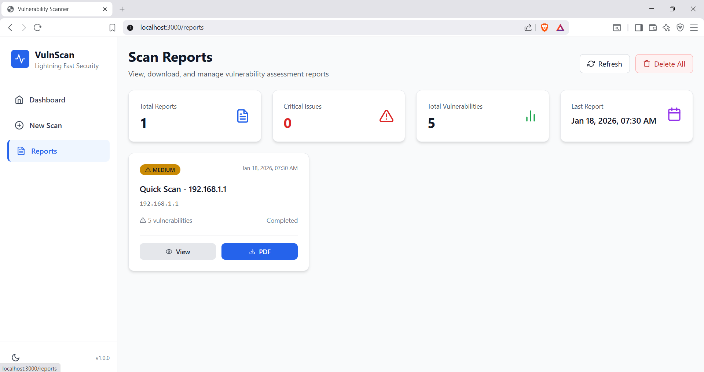
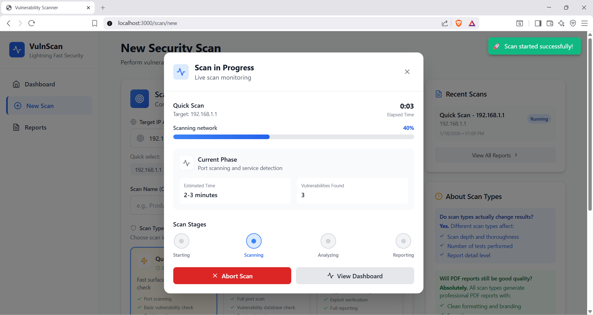

# VulnScan - Lightning Fast Security

> **Transform Your Security Posture in Minutes, Not Hours**

VulnScan revolutionizes vulnerability assessment with enterprise-grade security scanning delivered through a sleek, intuitive interface. Built for security professionals who demand speed without compromising depth, VulnScan combines cutting-edge scanning technology with real-time intelligence to protect what matters most.

## 🖼️ Feature Gallery

| Dashboard | New Scan |
|-----------|----------|
|  |  |

| Report View | Live Scan |
|-------------|-----------|
|  |  |

---


## 💎 Why VulnScan?

### The Problem
Traditional vulnerability scanners are either too slow for rapid assessments or too basic for comprehensive security analysis. Teams waste hours configuring complex tools, interpreting cryptic outputs, and generating reports manually.

### The Solution
VulnScan delivers **professional-grade security assessments in 2-60 minutes** with zero configuration complexity. Our intelligent scanning engine adapts to your needs—whether you need a quick security snapshot or deep penetration testing with actionable remediation plans.

### The VulnScan Advantage

**⚡ Speed That Doesn't Compromise**
- Quick Scan: Complete surface-level assessment in 2-5 minutes
- Standard Scan: Comprehensive vulnerability detection in 10-15 minutes  
- Deep Scan: Enterprise-grade penetration testing in 30-60 minutes
- Real-time progress monitoring with live vulnerability discovery

**🎯 Precision & Intelligence**
- Advanced port scanning with service fingerprinting
- Vulnerability database cross-referencing with exploit validation
- AI-driven risk severity classification (Critical → Low)
- Smart target recognition for routers, servers, gateways, and local machines

**📊 Professional Reporting That Impresses**
- One-click PDF generation with executive summaries
- Clean, branded reports ready for stakeholder presentation
- Detailed technical findings with remediation guidance
- Visual risk distribution analytics and trend analysis

**🚀 Enterprise Features, Zero Complexity**
- Intuitive web interface—no training required
- Live dashboard with auto-updating metrics
- Persistent scan history and comparative analysis
- Multi-target support for network-wide assessments

## 🏆 Built for Professionals

### Security Teams
Accelerate incident response with rapid vulnerability identification. VulnScan's Quick Scan mode provides critical intelligence in under 5 minutes, while Deep Scan delivers comprehensive penetration test results with remediation roadmaps.

### DevOps Engineers  
Integrate security into your CI/CD pipeline. Containerized architecture ensures consistent scanning across development, staging, and production environments with zero drift.

### Compliance Officers
Generate audit-ready reports instantly. VulnScan's professional PDF exports include all necessary documentation for SOC 2, ISO 27001, and PCI DSS compliance requirements.

### Network Administrators
Monitor your infrastructure's security posture effortlessly. Track vulnerability trends over time, identify recurring issues, and prioritize remediation based on actual risk severity.

## 📊 What You Get

### Intelligent Dashboard 
Your security command center featuring:
- **Real-Time Metrics**: Scans today, running scans, total vulnerabilities, critical issues
- **Target Intelligence**: Most scanned systems with efficiency scoring (98.5%+)
- **Risk Visualization**: Interactive severity distribution charts
- **Quick Actions**: One-click access to new scans, live monitoring, and prioritization

### Streamlined Scan Configuration 
Launch professional security assessments in seconds:
- **Smart Target Selection**: Quick-pick common targets or custom IP configuration
- **Scan Type Optimization**: Choose intensity based on time and depth requirements
- **Named Campaigns**: Organize scans with custom identifiers
- **Recent History**: Access previous scan configurations instantly

### Comprehensive Reporting 
Professional deliverables that speak to technical and executive audiences:
- **Executive Summary**: High-level risk overview with business impact
- **Vulnerability Catalog**: Complete findings with CVSS scores
- **Remediation Roadmap**: Prioritized action items with step-by-step guidance
- **Compliance Mapping**: Align findings with industry frameworks

### Live Scan Monitoring 
Watch your security assessment unfold in real-time:
- **Progress Tracking**: Visual progress bars with time estimates
- **Phase Indicators**: Current scanning stage (Network → Port → Service → Analysis)
- **Live Findings**: Vulnerabilities discovered as they're detected
- **Scan Control**: Pause, resume, or abort operations on-demand

## 🐳 Deploy in 60 Seconds

### Prerequisites
- Docker Engine 20.10+
- Docker Compose 2.0+ 
- Github 
- 2GB RAM minimum
- Network access to target systems

### One-Command Deployment

```bash
# Clone and launch
https://github.com/Karthiii06/VulnScan.git
cd vulnscan && docker-compose up -d

# Access at http://localhost:3000
```

### Manual Docker Build

```bash
# Build
docker build -t vulnscan:latest .

# Deploy
docker run -d -p 3000:3000 --name vulnscan vulnscan:latest
```

### Configuration Options

```env
PORT=3000                      # Web interface port
SCAN_TIMEOUT=3600              # Max scan duration (seconds)
MAX_CONCURRENT_SCANS=5         # Parallel scan limit
ENABLE_PDF_REPORTS=true        # Report generation
AUTO_UPDATE_VULNDB=true        # Keep vulnerability database current
```

## 🎯 Getting Started

### 1. Launch Your First Scan
Navigate to **New Scan** → Select target (192.168.1.1, server IP, or localhost) → Choose **Quick Scan** for rapid assessment → Start scanning

### 2. Monitor Progress
Watch real-time updates in the **Live Scan** modal → Track vulnerability discovery → View estimated completion time → Current phase: Port scanning & service detection

### 3. Review Findings  
Access **Reports** → View security summary dashboard → Analyze risk distribution → Identify critical issues requiring immediate action

### 4. Generate Documentation
Click **Download PDF** → Receive professional report → Share with stakeholders → Schedule remediation activities

### 5. Track Improvements
Return to **Dashboard** → Compare current vs. historical scans → Monitor vulnerability trends → Measure security posture improvements

## 🏗️ Architecture
```bash
vuln-scanner/
├── .git/                                ⚙️  Version control repository (Git metadata and history)
│
├── Assets/                              🎨 UI Design References & Mockups
│   ├── Dashboard.png                    📊 Main dashboard UI mockup
│   ├── LiveScan.png                     🔄 Real-time scanning interface mockup
│   ├── NewScan.png                      🆕 New scan configuration UI mockup
│   └── Report.png                       📋 Detailed report view mockup
│
├── frontend/                            🖥️  React TypeScript Frontend Application
│   ├── node_modules/                    📦 NPM dependencies (auto-generated, git-ignored)
│   │
│   ├── public/                          🌐 Static assets served directly
│   │   ├── index.html                   📄 Main HTML entry point
│   │   └── manifest.json                📱 PWA configuration for mobile/desktop installation
│   │
│   ├── src/                             💻 Source code
│   │   │
│   │   ├── components/                  🧩 Reusable UI components (organized by feature)
│   │   │   ├── Dashboard/               📊 Dashboard feature components
│   │   │   │   ├── Dashboard.tsx        🎯 Main dashboard container and layout
│   │   │   │   ├── QuickStats.tsx       📈 Statistics cards (total scans, vulnerabilities, etc.)
│   │   │   │   ├── RecentScansTable.tsx 📋 Table showing recent scan history
│   │   │   │   └── RiskDistributionChart.tsx 📊 Chart visualizing vulnerability severity distribution
│   │   │   │
│   │   │   ├── Layout/                  🏗️  Layout components
│   │   │   │   └── Layout.tsx           📐 Main layout wrapper with navigation, header, footer
│   │   │   │
│   │   │   ├── LiveScan/                🔄 Real-time scanning components
│   │   │   │   ├── LiveScan.tsx         🎯 Main live scan interface container
│   │   │   │   ├── ScanPhases.tsx       📋 Visual display of scan phases (port scanning, service detection, etc.)
│   │   │   │   └── ScanProgress.tsx     📊 Real-time progress bars and status indicators
│   │   │   │
│   │   │   ├── Reports/                 📋 Report viewing and management components
│   │   │   │   ├── ReportList.tsx       📋 Grid/list view of all scan reports
│   │   │   │   ├── ReportSummary.tsx    📊 Executive summary of a single report
│   │   │   │   ├── ReportView.tsx       📄 Detailed view of a single scan report
│   │   │   │   └── VulnerabilityTable.tsx 🗃️  Table displaying vulnerability findings
│   │   │   │
│   │   │   └── Scan/                    🆕 Scan creation components
│   │   │       └── NewScan.tsx          📝 Form for configuring and starting new scans
│   │   │
│   │   ├── hooks/                       🪝 Custom React hooks
│   │   │   └── useWebSocket.ts          🔌 Hook for WebSocket connections (real-time updates)
│   │   │
│   │   ├── types/                       📐 TypeScript type definitions and interfaces
│   │   │   └── index.ts                 📋 Centralized type definitions for API responses, components, etc.
│   │   │
│   │   ├── utils/                       🛠️  Utility functions and helpers
│   │   │   ├── api.ts                   🔌 Axios API client configuration and service functions
│   │   │   └── events.ts                🎯 Event handling utilities and constants
│   │   │
│   │   ├── App.tsx                      🎮 Root React component with routing configuration
│   │   ├── index.tsx                    ⚡ React application entry point
│   │   └── index.css                    🎨 Global CSS styles and Tailwind directives
│   │
│   ├── .dockerignore                    🐳 Files to exclude from Docker builds (frontend)
│   ├── Dockerfile                       🐳 Docker container configuration for frontend
│   ├── package.json                     📦 NPM dependencies, scripts, and project metadata
│   ├── package-lock.json                🔒 Locked dependency versions for reproducible builds
│   ├── postcss.config.js                🎨 PostCSS configuration for CSS processing
│   ├── tailwind.config.js               🎨 Tailwind CSS framework configuration
│   ├── tsconfig.json                    ⚙️  TypeScript compiler configuration
│   └── tsconfig.node.json               ⚙️  TypeScript configuration for Node.js/build tools
│
├── backend/                             🖥️  FastAPI Backend Server
│   ├── app/                             🏗️  Main application package
│   │   │
│   │   ├── api/                         🌐 API Route handlers (REST endpoints)
│   │   │   ├── dashboard.py             📊 Endpoints for dashboard metrics and statistics
│   │   │   ├── reports.py               📋 Endpoints for report CRUD operations and downloads
│   │   │   └── scans.py                 🔍 Endpoints for scan management and WebSocket connections
│   │   │
│   │   ├── core/                        ⚙️  Core application configuration and utilities
│   │   │   ├── config.py                ⚙️  Application settings, environment variables, CORS config
│   │   │   └── security.py              🔒 Security utilities (authentication, password hashing)
│   │   │
│   │   ├── models/                      🗃️  Database models (SQLAlchemy ORM)
│   │   │   └── scan.py                  🗃️  Scan and Vulnerability model definitions
│   │   │
│   │   ├── services/                    ⚙️  Business logic and service layer
│   │   │   ├── scanner.py               🔍 Core vulnerability scanning engine (Nmap integration)
│   │   │   └── report_generator.py      📄 PDF report generation service (Jinja2 + reportlab)
│   │   │
│   │   ├── db/                          🗃️  Database configuration
│   │   │   └── session.py               🔌 SQLAlchemy database session factory and connection
│   │   │
│   │   └── templates/                   📝 HTML templates
│   │       └── report.html              📋 Jinja2 template for PDF report generation
│   │
│   ├── venv/                            🐍 Python virtual environment (git-ignored)
│   ├── Dockerfile                       🐳 Docker container configuration for backend
│   ├── main.py                          🚀 FastAPI application entry point and server setup
│   ├── requirements.txt                 📦 Python dependencies (FastAPI, SQLAlchemy, Nmap, etc.)
│   ├── test.db                          🧪 Test SQLite database for development/testing
│   ├── test_excel_autofit.py            🧪 Test script for Excel report formatting
│   └── vulnscanner.db                   🗃️  Main SQLite database (production data, git-ignored)
│
├── docker-compose.yml                   🐳 Multi-container orchestration for full stack deployment
├── .dockerignore                        🐳 Files to exclude from all Docker builds
├── .gitignore                           👁️  Files and directories to ignore in Git version control
└── README.md                            📖 Project documentation and setup instructions
```
## 🔐 Security & Compliance

**Authorization**: VulnScan must only be used on authorized networks. Unauthorized scanning may violate computer fraud laws.

**Data Privacy**: All scan results stored locally. No external data transmission. GDPR and CCPA compliant by design.

**Network Safety**: Configurable scan intensity prevents network disruption. Rate limiting ensures production system stability.

**Audit Trail**: Complete scan logs with timestamps, targets, findings, and user actions for compliance documentation.

## 🛠️ API Reference

### RESTful Endpoints

```javascript
// Create scan
POST /api/scans
Body: { target: "192.168.1.1", type: "quick", name: "Production Router" }

// Monitor progress
GET /api/scans/:id/status
Response: { progress: 45, phase: "scanning", vulnerabilities: 3 }

// Retrieve report
GET /api/reports/:id
Response: { findings: [...], severity: {...}, recommendations: [...] }

// Export PDF
GET /api/reports/:id/pdf
Response: Binary PDF stream

// Delete scan
DELETE /api/scans/:id
```

## 🚀 Advanced Features

### Scheduled Scanning
```bash
# Configure cron for automated weekly scans
0 2 * * 0 curl -X POST http://localhost:3000/api/scans -d '{"target":"192.168.1.1","type":"standard"}'
```

### Integration Support
- **Webhook Notifications**: Real-time alerts to Slack, Teams, Discord
- **SIEM Integration**: Export findings to Splunk, ELK, QRadar
- **CI/CD Pipeline**: GitHub Actions, GitLab CI, Jenkins plugins

## 💼 Business Value

**Time Savings**: Reduce security assessment time from hours to minutes—increase team productivity by 80%

**Cost Efficiency**: Eliminate expensive third-party scanning services—ROI achieved within first month

**Risk Reduction**: Identify critical vulnerabilities before attackers do—prevent costly security incidents

**Compliance Confidence**: Generate audit-ready documentation instantly—streamline certification processes

## ⚠️ Disclaimer

 **For Educational Use Only.** This software is provided "as-is" without any warranties. I am not responsible for data loss.                
 **Note:** This was done to increase my understanding of stack development and vulnerability prediction not to use for unlawful activities